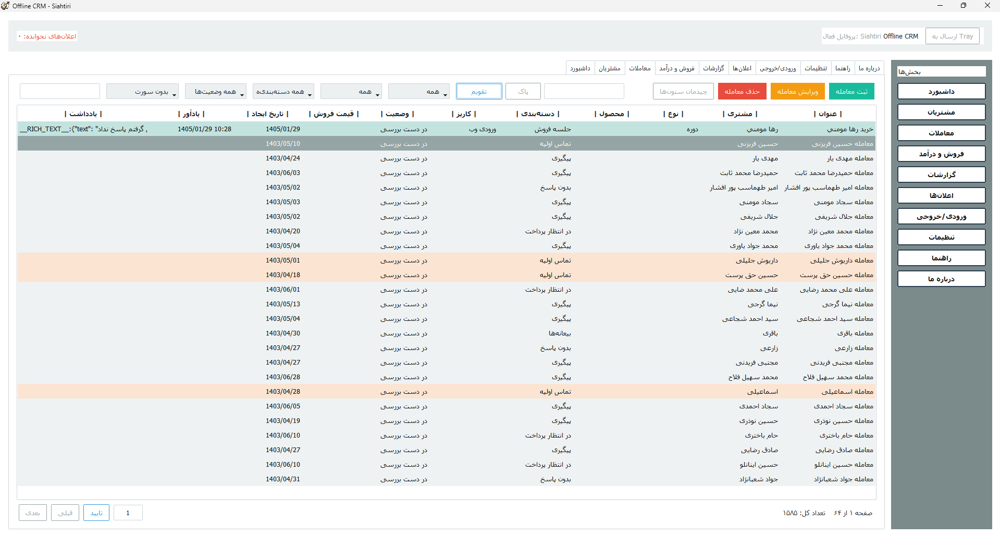

# Offline CRM

**نرم‌افزار CRM آفلاین برای ویندوز**

نرم افزار Offline CRM یک ‌اپ مدیریت ارتباط با مشتری است که برای ویندوز طراحی شده و بدون نیاز به اینترنت، به شما کمک می‌کند مشتری‌ها، معاملات، یادآورها، پیگیری‌ها و گزارش‌های فروش را در یک محیط ساده، حرفه‌ای و فارسی مدیریت کنید.

این برنامه برای کسب‌وکارهایی مناسب است که می‌خواهند اطلاعات مشتریان و فرآیند فروش را **روی سیستم خودشان، به‌صورت آفلاین، سریع و بدون وابستگی به سرویس‌های آنلاین** مدیریت کنند.

---

## چرا Offline CRM؟

اگر از فایل‌های پراکنده، یادداشت‌های نامنظم، فراموش شدن پیگیری مشتریان و سختی گزارش‌گیری خسته شده‌اید، این نرم‌افزار دقیقاً برای همین ساخته شده است.

با Offline CRM می‌توانید:

- مشتری‌های خود را منظم ثبت و دسته‌بندی کنید
- برای معاملات یادآور تعیین کنید تا هیچ پیگیری مهمی از دست نرود
- وضعیت فروش را در کاریزها و دسته‌بندی‌های مختلف ببینید
- یادداشت‌های هر معامله را با جزئیات نگه دارید
- آمار فروش، درآمد، نرخ موفقیت و عملکرد تیم را بررسی کنید
- از اطلاعات خود خروجی اکسل بگیرید یا دوباره از اکسل وارد کنید
- همه چیز را **کاملاً رایگان** و روی ویندوز خودتان مدیریت کنید

---

## قابلیت‌های اصلی

### 1) مدیریت مشتریان
در این بخش می‌توانید اطلاعات هر مشتری را ثبت و نگهداری کنید؛ از جمله نام، شماره موبایل، تاریخ تولد و سطح درآمد. همچنین برای جلوگیری از بی‌نظمی، تکراری بودن شماره موبایل بررسی می‌شود تا دیتابیس شما تمیز و قابل اعتماد بماند.

### 2) مدیریت معاملات و پیگیری فروش
برای هر مشتری می‌توانید معامله ثبت کنید و جزئیاتی مثل عنوان معامله، نوع معامله، محصول، دسته‌بندی، کاریز، وضعیت، قیمت فروش، کمیسیون اپراتور، کارشناس فروش، یادآور و توضیحات را ذخیره کنید.

وضعیت معامله‌ها نیز به‌صورت مشخص قابل ثبت است، مثل:

- در دست بررسی
- موفق
- ناموفق

### 3) یادآورها و اعلان‌ها
یکی از مهم‌ترین بخش‌های برنامه، سیستم یادآور است. برای هر معامله می‌توانید زمان پیگیری تعیین کنید. وقتی زمان یادآور برسد، اعلان ساخته می‌شود تا پیگیری از دست نرود. برای تولد مشتری‌ها هم اعلان روز تولد ثبت می‌شود.

اعلان‌ها به‌صورت بازنشده و خوانده‌شده مدیریت می‌شوند و می‌توانید آن‌ها را به‌صورت موردی یا گروهی بررسی کنید.

### 4) یادداشت‌گذاری حرفه‌ای برای هر معامله
برای هر معامله می‌توان یادداشت ثبت کرد و تاریخچه یادداشت‌ها را نگه داشت. این قابلیت برای تیم فروش خیلی مهم است، چون تمام جزئیات تماس‌ها، نتیجه پیگیری‌ها، توافق‌ها و وضعیت مشتری در یکجا باقی می‌ماند.

### 5) مدیریت کاریز، دسته‌بندی، نوع معامله و محصول
نرم‌افزار فقط یک فرم ساده ثبت اطلاعات نیست. شما می‌توانید ساختار فروش خودتان را هم شخصی‌سازی کنید:

- تعریف کاریزهای فروش
- تعریف دسته‌بندی‌های معامله با رنگ‌بندی
- تعریف نوع معامله
- تعریف محصولات وابسته به هر نوع معامله

این یعنی CRM دقیقاً با مدل فروش شما هماهنگ می‌شود.

### 6) چند پروفایلی بودن
هر کاربر ویندوز می‌تواند چند پروفایل مستقل بسازد و هر پروفایل با نام کاربری و رمز عبور خودش وارد شود. این قابلیت برای استفاده شخصی، تیمی یا تفکیک چند مجموعه روی یک سیستم بسیار کاربردی است.

### 7) داشبورد مدیریتی
در داشبورد، یک نمای سریع از وضعیت فعلی سیستم فروش در اختیار شما قرار می‌گیرد؛ مثل:

- تعداد مشتریان
- تعداد معاملات
- تعداد موارد در دست بررسی
- درآمد ماهیانه

این بخش برای تصمیم‌گیری سریع و مشاهده وضعیت کلی بسیار مفید است.

### 8) گزارش فروش و درآمد
بخش گزارش‌ها و تحلیل فروش، یکی از جذاب‌ترین قسمت‌های نرم‌افزار است. در این بخش می‌توانید فروش را به‌صورت:

- روزانه
- ماهانه
- سالانه

بررسی کنید.

همچنین گزارش‌هایی مثل موارد زیر در دسترس هستند:

- پرفروش‌ترین روز
- پرفروش‌ترین ماه
- نرخ موفقیت معاملات
- ترکیب وضعیت معاملات
- درآمد بر اساس دسته‌بندی
- تعداد معامله بر اساس کاریز
- جمع کمیسیون اپراتور

### 9) جستجو، فیلتر، سورت و صفحه‌بندی
برای اینکه کار با داده‌های زیاد سخت نشود، در بخش‌های مختلف برنامه امکاناتی مثل جستجو، مرتب‌سازی، فیلتر و صفحه‌بندی در نظر گرفته شده است. این یعنی حتی اگر تعداد مشتری‌ها و معاملات شما زیاد شود، باز هم مدیریت آن‌ها ساده می‌ماند.

### 10) تاریخ شمسی و رابط فارسی
رابط کاربری برنامه فارسی است و برای تاریخ‌ها از تقویم شمسی استفاده می‌شود. این موضوع باعث می‌شود کار با برنامه برای کاربر فارسی‌زبان بسیار راحت‌تر و طبیعی‌تر باشد.

### 11) ورودی و خروجی اکسل
برای داده‌های اصلی نرم‌افزار می‌توانید فایل اکسل **Xlsx** وارد یا صادر کنید. این قابلیت برای جابه‌جایی اطلاعات، آرشیو، گزارش‌گیری، بکاپ‌گیری و انتقال داده‌ها بسیار کاربردی است.

بخش‌هایی که از اکسل پشتیبانی می‌کنند:

- مشتریان
- معاملات
- کاریزها
- دسته‌بندی‌های معامله
- نوع معامله
- محصولات نوع معامله

نکته مهم این است که ستون شناسه لازم نیست در فایل شما باشد و خود برنامه آن را مدیریت می‌کند.

### 12) ذخیره‌سازی محلی و آفلاین
اطلاعات نرم‌افزار به‌صورت محلی ذخیره می‌شود و برای استفاده روزمره نیازی به اینترنت ندارد. این موضوع هم سرعت کار را بالا می‌برد و هم برای مجموعه‌هایی که حفظ اطلاعات روی سیستم خودشان برایشان مهم است، یک مزیت جدی محسوب می‌شود.

### 13) اجرای خودکار با ویندوز
در تنظیمات برنامه امکان ثبت در استارت‌آپ ویندوز هم در نظر گرفته شده تا نرم‌افزار در صورت نیاز همراه با ویندوز اجرا شود.

---

## این نرم‌افزار برای چه کسانی مناسب است؟

نرم افزار Offline CRM می‌تواند برای این گروه‌ها بسیار مناسب باشد:

- فروشندگان و کارشناسان فروش
- کال‌سنترها و تیم‌های پیگیری مشتری
- کسب‌وکارهای کوچک و متوسط
- مجموعه‌هایی که CRM آنلاین نمی‌خواهند
- افرادی که به دنبال یک CRM ساده، فارسی، سریع و آفلاین هستند

---

## مزیت مهم این پروژه

این نرم‌افزار برای استفاده روزمره طراحی شده؛ یعنی هم ظاهر کاربری مناسبی دارد، هم امکانات مهم CRM را پوشش می‌دهد، و هم شما را مجبور نمی‌کند برای هر کار ساده سراغ سرویس‌های آنلاین، اشتراک ماهانه یا ابزارهای پیچیده بروید.

در واقع با یک نرم‌افزار سبک و کاربردی طرف هستید که روی ویندوز اجرا می‌شود و هسته اصلی نیازهای مدیریت مشتری و فروش را پوشش می‌دهد.

---

## رایگان بودن

این پروژه به‌عنوان یک CRM آفلاین ویندوزی ارائه شده و در این معرفی، **کاملاً رایگان** معرفی می‌شود. اگر به‌دنبال یک ابزار کاربردی برای مدیریت مشتری و فروش هستید که بدون هزینه اشتراک، بدون وابستگی به اینترنت و با محیطی فارسی کار کند، Offline CRM انتخاب بسیار خوبی است.

---

## جمع‌بندی

نرم افزار Offline CRM یک برنامه‌ CRM فارسی، ویندوزی و آفلاین است که امکانات مهمی مثل مدیریت مشتریان، مدیریت معاملات، یادآورها، اعلان‌ها، یادداشت‌گذاری، گزارش فروش، تحلیل درآمد، ورود و خروج اکسل، چندپروفایلی بودن و شخصی‌سازی ساختار فروش را در اختیار شما قرار می‌دهد.

اگر بخواهید یک CRM جمع‌وجور اما حرفه‌ای داشته باشید که **ساده، سریع، رایگان و کاملاً کاربردی** باشد، این پروژه می‌تواند دقیقاً همان چیزی باشد که نیاز دارید.

---

## اطلاعات سازنده

- برند: **POWEREN**
- وب‌سایت: **poweren.ir**
- گیت‌هاب: **siahtirilab/Offline-CRM**
- ایمیل: **siahtirim@gmail.com**
